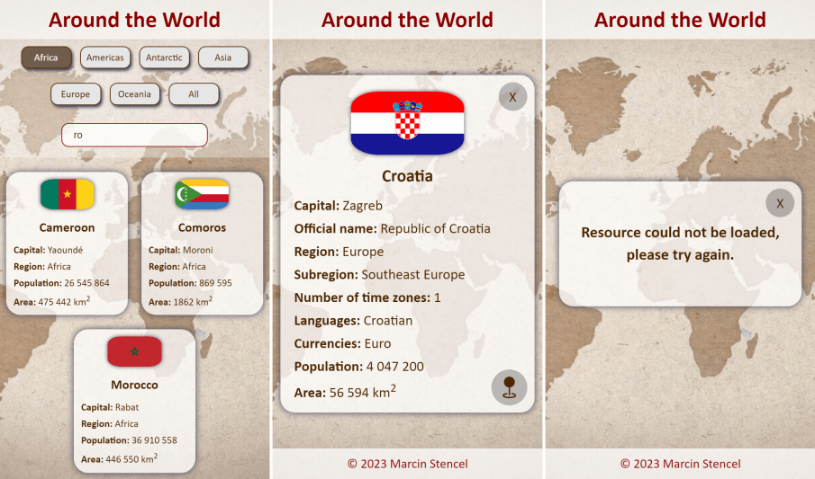

# Around the World

An application that allows you to receive information about all countries of the world using external API.

## What i used
            

## Screenshots

## Live
[https://around-the-world-application.netlify.app](https://around-the-world-application.netlify.app)

## Solutions
- ES modules
- Fetch API
- Event delegation
- Handling try...catch blocks
- Dynamically creating and appending HTML elements in JS (two different methods)
- Two search filters
- Lazy loading
- Vite plugins
- ESLint with Airbnb config